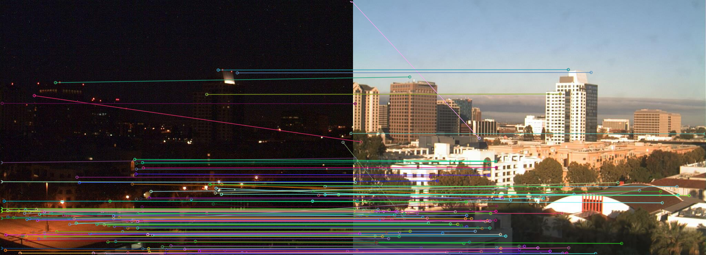
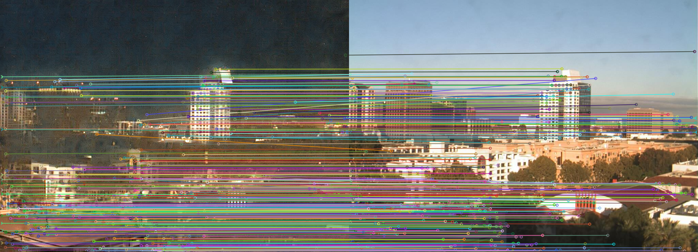
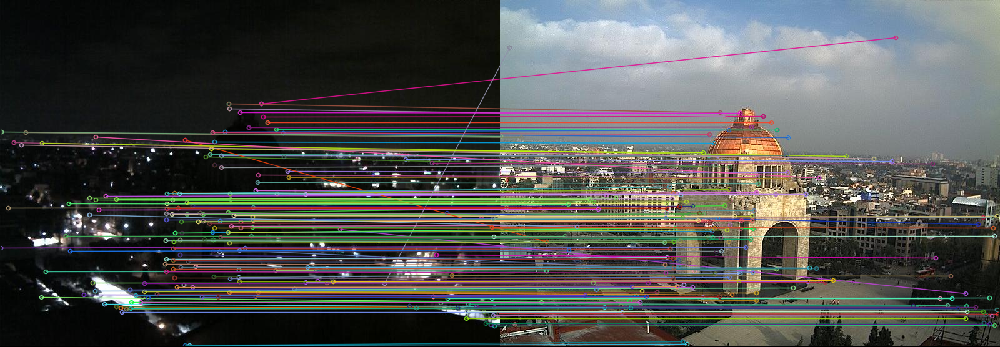
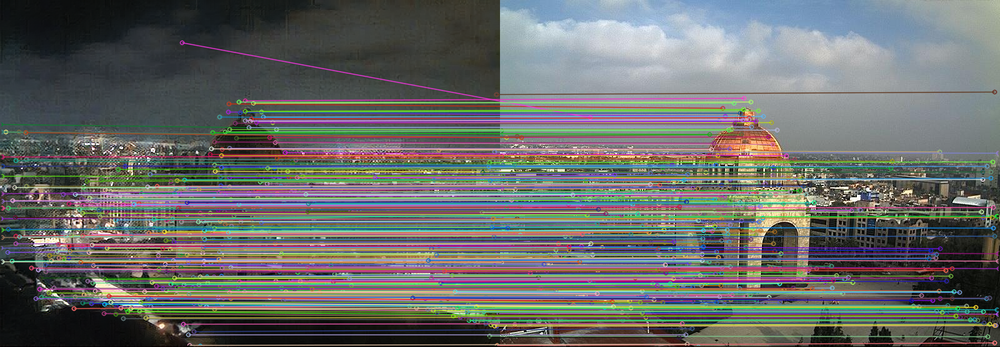

# Style Transfer for Keypoint Matching under Adverse Conditions

This repository contains the implementation of the following paper:

```text
"Style Transfer for Keypoint Matching under Adverse Conditions".
Ali Uzpak, Abdelaziz Dejlouah, Simone Schaub-Meyer. 3DV 2020.
```
[[Link to PDF]](https://ethz.ch/content/dam/ethz/special-interest/infk/inst-ivc/mtc-dam/documents/Publications/Style%20Transfer%20for%20Keypoint%20Matching%20under%20Adverse%20Conditions%203DV%202020.pdf)

This code is based on [D2-Net](https://github.com/mihaidusmanu/d2-net), [R2D2](https://github.com/naver/r2d2) and [Fast Style Transfer](https://github.com/rrmina/fast-neural-style-pytorch).
    
## Requirements

The code works with Python 3.6.10 and the following libraries: 
- Pytorch 1.4.0 with CUDA 10.0.130 and cuDNN 7.6.3
- torchvision 0.5.0
- OpenCV 3.4.2
- scikit-image 0.17.2
- tqdm 4.41.1
- matplotlib 3.3.2

Newer versions of these libraries will very likely work as well.

Our machine is equipped with an Nvidia GTX 1080 Ti GPU that has 11GB of memory.

## Optimization

To match an image1 (night) to image2 (day), run

```bash
python optimize.py --image1_path input_images/dnim1.jpg --image2_path input_images/dnim2.jpg --num_steps_per_image 800 --content_steps 400 --output_path output_results/
```
The execution time can be 3 to 5 minutes on a modern GPU.

The main parameters are:

- `image1_path`: path to the image that has the adverse condition (night). This is going to be translated with the transformer.
- `image2_path`: path to the image that does not have the adverse condition (day).
- `num_steps_per_image`: total number of optimization steps for each image pair to be matched.
- `content_steps`: first number of optimization steps during which the transformer only minimizes the content loss. 

For images `im1` and `im2`, the results will be in `output_path` and consist of:

- `translated_im1_im2.png`: translation (i.e. output of the transformer) of the night image1 according to the style of image2.
- `original_matches_im1_im2_ninliers_X.png`: image showing the matches (with #RANSAC inliers = X) using the D2-Net descriptors computed on the original image pair.
- `new_matches_im1_im2_ninliers_Y.png`: image showing the matches (with #RANSAC inliers = Y) using our method. D2-Net descriptors are computed on the translated image1 and matched with the D2-Net descriptors computed on the original image2.
- `translator_data_im1_im2.npz`: numpy file that encapsulates the R2D2 keypoints for both images, as well as the original and new matches (not filtered by RANSAC in this case). You can read this file with 'np.load()' and then access the keys 'kp1_r2d2', 'kp2_r2d2', 'translator_matches', 'original_d2net_matches' 

Some precomputed results can be found in `precomputed_output_results/`.

The other examples of this repository can be computed with the following commands:

```bash
python optimize.py --image1_path input_images/dnim3.jpg --image2_path input_images/dnim4.jpg --num_steps_per_image 800 --content_steps 400 --output_path output_results/

python optimize.py --image1_path input_images/aachen1.jpg --image2_path input_images/aachen2.jpg --num_steps_per_image 800 --content_steps 400 --output_path output_results/
```


## Remarks

- Input images are resized to make sure that they fit in the GPU memory. The allowed maximum size can be adapted to your GPU in the file `optimize.py`.
- R2D2 keypoints are combined with D2-Net descriptors using bilinear interpolation. This combination usually achieves the best results (cf. paper).
- Images in this repository come from the [DNIM](http://users.umiacs.umd.edu/~hzhou/dnim.html) and [Aachen Day-Night](https://www.visuallocalization.net/datasets/) datasets.

## Reproducing the paper's results

To reproduce the paper's results on the DNIM dataset, we provide the `dnim_matching_list.txt` file which contains the 612 image pairs that we matched. However, if you want to match all those pairs using our optimization procedure, it will takes a while. We parallelized this task using 5 computers which took less than 1 day to finish.

## Visual results

With D2-Net descriptors only (124 inliers):



With our method (415 inliers!):



Similarily:

With D2-Net descriptors only (176 inliers):



With our method (472 inliers):


 
## BibTeX

If you use this code in your project, please cite the following paper:

```bibtex
@inproceedings{Uzpak2020,
  author={Uzpak, Ali and Djelouah, Abdelaziz and Schaub-Meyer, Simone},
  title={Style Transfer for Keypoint Matching under Adverse Conditions},
  booktitle = {3DV},
  year = {2020}
}
```
